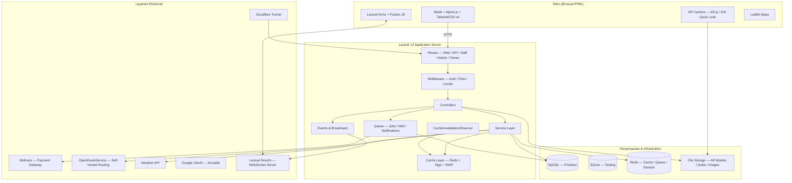
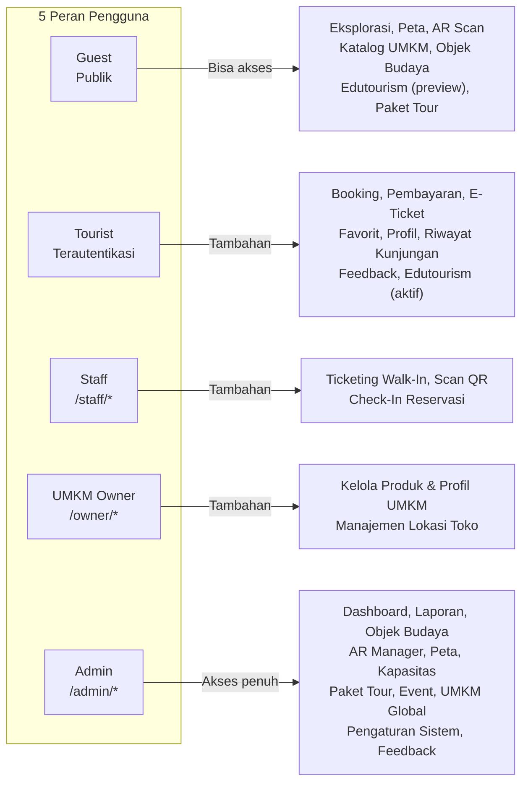
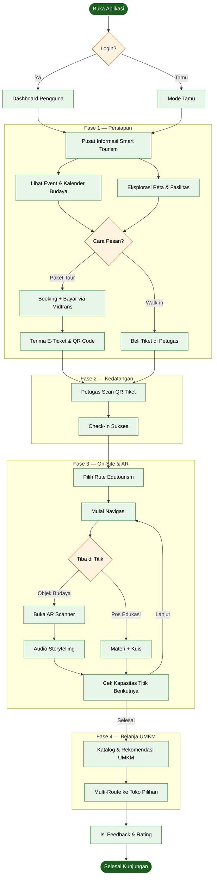

<div align="center">

# Website Wisata Desa Penglipuran

**Platform Smart Sustainable Edutourism untuk Desa Wisata Penglipuran, Bali**

<br>

[](https://laravel.com)
[](https://php.net)
[](https://tailwindcss.com)
[](https://alpinejs.dev)
[](LICENSE)

</div>

---

## Tentang Aplikasi

Website Wisata Desa Penglipuran adalah **platform web edutourism cerdas dan berkelanjutan** yang dirancang khusus untuk [Desa Wisata Penglipuran](https://id.wikipedia.org/wiki/Penglipuran,_Kubu,_Bangli), salah satu desa wisata terbersih di dunia yang terletak di Kabupaten Bangli, Bali.

Aplikasi ini mengadopsi filosofi desain **"Super App / Modular Grid-Based Utility"** (terinspirasi Grab/Gojek) yang dioptimalkan untuk penggunaan _outdoor mobile-first_. Tujuannya bukan sekadar menjadi brosur digital, melainkan sebuah **alat bantu perjalanan yang aktif** yang menemani pengunjung dari sebelum, selama, hingga setelah berkunjung.

### Nilai Utama

- **Edukasi Berbasis Lokasi** — Pengunjung mendapatkan konten edukatif yang kaya (cerita, audio narasi, kuis) secara kontekstual saat tiba di titik-titik wisata.
- **AR Immersif** — Teknologi Augmented Reality berbasis marker (AR.js/A-Frame + iOS Quick Look) memperlihatkan model 3D benda cagar budaya langsung melalui kamera ponsel.
- **Distribusi Ekonomi Adil** — Algoritma rekomendasi UMKM (`UmkmRecommendationService`) memastikan eksposur yang merata bagi seluruh pelaku usaha kecil di desa.
- **Pemantauan Kapasitas Real-Time** — Sistem WebSocket berbasis Laravel Reverb memantau keramaian setiap zona dan mengirim peringatan saat ambang batas kapasitas terlampaui.

---

## Arsitektur Sistem

### Gambaran Tinggi



### Lapisan Peran & Akses



---

## Fitur Lengkap

### Untuk Pengunjung (Tourist & Guest)

| Fitur | Deskripsi |
|---|---|
| **Eksplorasi & Peta Interaktif** | Leaflet map dengan pin lokasi (budaya, UMKM, fasilitas), bottom sheet detail ala Google Maps, navigasi turn-by-turn via OpenRouteService. |
| **AR Scan & Viewer** | Arahkan kamera ke marker PATT untuk memunculkan model 3D (GLB/GLTF). iOS: AR Quick Look via USDZ. Overlay glassmorphism HUD. |
| **Objek Budaya Digital** | Halaman detail dengan narasi audio (range-request streaming), galeri historis, cerita berlapis (sejarah, filosofi, nilai), dan kuis interaktif. |
| **Smart Edutourism** | Ikuti rute berpemandu yang terkunci secara progresif—titik berikutnya terbuka hanya setelah pengunjung tiba di titik saat ini. Termasuk kuis per-titik. |
| **Katalog UMKM** | Daftar produk UMKM lokal dengan rekomendasi berbasis lokasi dan rotasi adil. Multi-route untuk kunjungan beberapa toko sekaligus. |
| **Booking & Pembayaran** | Pemesanan paket tour dengan pembayaran digital via Midtrans (Snap). E-ticket dikirim ke email. Walk-in via petugas dengan Snap token on-site. |
| **Event Budaya** | Kalender event dengan detail, lokasi, dan pendaftaran. Pengingat email otomatis 1 hari sebelum acara. |
| **Profil & Favorit** | Riwayat kunjungan, daftar favorit (polimorfik: objek budaya, event, paket, UMKM), dan manajemen reservasi. |
| **Multilingual** | Konten tersedia dalam Bahasa Indonesia dan English. Pengguna dapat beralih via `/lang/{locale}` atau preferensi profil. |
| **Push Notifications** | Notifikasi push berbasis Web Push API untuk pengingat event dan peringatan kapasitas. |

### Untuk Admin & Staf

| Fitur | Deskripsi |
|---|---|
| **Dashboard & Laporan** | Ringkasan kunjungan, pendapatan, kapasitas zona real-time. Export laporan PDF. |
| **AR Manager** | Upload model 3D (GLB/USDZ) via TUS chunked upload, kelola marker PATT, hubungkan ke lokasi peta. |
| **Manajemen Konten** | CRUD objek budaya (TipTap WYSIWYG, rich text), cerita, galeri, audio narasi. Import massal via XLSX. |
| **Kapasitas Real-Time** | Definisikan zona geofence dengan ambang batas kapasitas. Peringatan WebSocket otomatis saat zona kritis. |
| **UMKM Global** | Kelola seluruh profil UMKM, produk, kategori, dan akun pemilik. |
| **Ticketing** | Scan QR e-ticket pengunjung, proses walk-in, check-in, pembatalan, dan refund via Midtrans. |
| **Pengaturan Desa** | Konfigurasi umum sistem (nama desa, kontak, jam operasional, dll.). |
| **Auto-Translate** | Proxy LibreTranslate terintegrasi di form admin untuk mengisi otomatis konten bilingual. |

---

## Alur Perjalanan Pengunjung



---

## Model Domain & Relasi Data

```mermaid
erDiagram
    users {
        int id PK
        string name
        string email
        string role "tourist|umkm_owner|admin|staff"
        string preferred_language
    }

    cultural_objects {
        int id PK
        json name "translatable"
        string slug
        string category "temple|house|craft|tradition"
        decimal latitude
        decimal longitude
        string ar_marker_id
    }

    cultural_stories {
        int id PK
        int cultural_object_id FK
        json title "translatable"
        json content "translatable"
        string story_type "history|philosophy|value"
        int order
    }

    ar_models {
        int id PK
        json name "translatable"
        string glb_path
        string usdz_path
        string patt_path
    }

    map_locations {
        int id PK
        string locationable_type "morph"
        int locationable_id "morph"
        string category
        decimal latitude
        decimal longitude
    }

    tour_routes {
        int id PK
        json name "translatable"
        string difficulty "easy|moderate|challenging"
        int estimated_duration_minutes
        int distance_meters
    }

    tour_route_points {
        int id PK
        int tour_route_id FK
        string locationable_type "morph"
        int locationable_id "morph"
        int order
        json storytelling_content "translatable"
    }

    tour_packages {
        int id PK
        json name "translatable"
        decimal price
        int duration_hours
        int max_capacity
    }

    reservations {
        int id PK
        int user_id FK
        int tour_package_id FK
        string status "pending|confirmed|completed|cancelled"
        string payment_status "unpaid|paid|refunded"
        string qr_code
    }

    umkm_profiles {
        int id PK
        int user_id FK
        json business_name "translatable"
        string category
        decimal latitude
        decimal longitude
    }

    umkm_products {
        int id PK
        int umkm_profile_id FK
        json name "translatable"
        decimal price
    }

    capacity_zones {
        int id PK
        string name
        int max_capacity
        int warning_threshold
        int critical_threshold
        int current_count
    }

    events {
        int id PK
        json name "translatable"
        datetime start_datetime
        string category
    }

    feedbacks {
        int id PK
        int user_id FK
        int reservation_id FK
        int rating
        string feedback_type
    }

    users ||--o{ reservations : "membuat"
    users ||--o{ umkm_profiles : "memiliki"
    users ||--o{ feedbacks : "menulis"
    cultural_objects ||--o{ cultural_stories : "punya"
    cultural_objects ||--o| map_locations : "punya lokasi"
    tour_routes ||--o{ tour_route_points : "terdiri dari"
    tour_packages ||--o{ reservations : "dipesan via"
    umkm_profiles ||--o{ umkm_products : "menjual"
    umkm_profiles ||--o| map_locations : "punya lokasi"
    reservations ||--o{ feedbacks : "menerima"
    ar_models ||--o| map_locations : "terpasang di"
```



---

## Sistem Multilingual (Dual-Layer i18n)

Aplikasi menggunakan dua lapisan internasionalisasi yang terpisah:

```
Layer 1 — UI Strings
  lang/en.json, lang/id.json      → teks tombol, label, pesan
  lang/en/, lang/id/              → file PHP Laravel (validasi, auth)

Layer 2 — Konten Model (spatie/laravel-translatable)
  DB column (JSON): {"en": "...", "id": "..."}
  Diakses via: $model->getTranslation('name', 'en')
  Helper: translateValue($model->name)   ← safe extraction
```

**Aturan penulisan penting:** Kode yang menulis ke field translatable (seeder, factory, tinker) **wajib** menggunakan array berlabel locale — `['id' => '...', 'en' => '...']`. Menulis string polos akan menyimpan nilai hanya di locale aktif saat itu (default `en` di CLI), membuat tab bahasa lain kosong.

---

## Stack Teknologi

| Lapisan | Teknologi |
|---|---|
| **Backend** | Laravel 13, PHP 8.4 |
| **Frontend** | TailwindCSS v4, Alpine.js v3, Vite 8 |
| **Templating** | Blade, Livewire 4 (navigasi saja) |
| **Database** | MySQL (dev & prod), SQLite (testing) |
| **Cache & Queue** | Redis (tags + Stale-While-Revalidate) |
| **WebSocket** | Laravel Reverb, Laravel Echo, Pusher-JS |
| **Auth** | Session-based + Google OAuth (Socialite) |
| **Pembayaran** | Midtrans Snap |
| **AR** | AR.js / A-Frame (WebAR), iOS AR Quick Look (USDZ) |
| **Peta** | Leaflet + OpenRouteService (self-hosted) |
| **Upload Besar** | TUS Chunked Upload (ankitpokhrel/tus-php) |
| **Rich Text** | TipTap (ESM dari esm.sh, tanpa NPM lokal) |
| **Multilingual** | spatie/laravel-translatable |
| **Spreadsheet** | phpoffice/phpspreadsheet (import XLSX) |
| **QR Code** | bacon/bacon-qr-code |
| **Infrastruktur** | Cloudflare Tunnel, Docker (opsional) |

---

## Desain Sistem

Antarmuka dirancang untuk **keterbacaan di luar ruangan di bawah sinar matahari langsung**.

### Palet Warna

| Peran | Nama | Hex |
|---|---|---|
| Brand / CTA | Penglipuran Green | `#1E5128` |
| Aksen | Bali Gold | `#D4AF37` |
| Background | Clean Off-White | `#FAF9F6` |
| Surface (card/modal) | Solid White | `#FFFFFF` |
| Teks Utama | Charcoal Dark | `#191A19` |
| Peringatan Keramaian | Alert Amber | `#E65100` |

### Tipografi

- **Plus Jakarta Sans / Inter** — semua elemen UI, label, harga
- **Playfair Display** — *hanya* untuk judul storytelling budaya dan headline halaman budaya

### Pola UI Utama

- **Bento Grid** — homepage dengan matriks ikon 4×2 / 3×2 untuk akses instan fitur
- **Bottom Navigation** — 5 tab, tombol AR di tengah melayang (_floating cutout_)
- **Bottom Sheet** — detail pin peta dibuka as drawer (swipeable), bukan halaman baru
- **Skeleton Loading** — pulse animation, bukan spinner, saat data dimuat
- **Glassmorphism HUD** — overlay AR menggunakan `backdrop-blur-md` agar viewfinder tetap terlihat
- **Haptic Feedback** — `navigator.vibrate(50)` pada aksi inti (pembayaran, deteksi marker AR)
- **Tap Target minimum** — 44×44px pada semua tombol dan ikon

---

## Memulai

### Prasyarat

- PHP ≥ 8.4
- Composer
- Node.js ≥ 20 & npm
- Redis
- MySQL (untuk dev penuh) atau SQLite (testing saja)
- Ekstensi PHP: `pdo`, `pdo_mysql`, `redis`, `gd`

### Instalasi

```bash
git clone <repo-url>
cd ganesha_smart_edutourism

# Salin .env dan sesuaikan konfigurasi DB, Redis, Midtrans, dll.
cp .env.example .env

# Setup lengkap: install deps, generate key, migrate, build assets
composer setup
```

### Variabel Lingkungan Penting

```env
APP_URL=http://localhost:8000
DB_CONNECTION=mysql

CACHE_STORE=redis
QUEUE_CONNECTION=redis

REVERB_APP_ID=...
REVERB_APP_KEY=...
REVERB_APP_SECRET=...

MIDTRANS_SERVER_KEY=...
MIDTRANS_CLIENT_KEY=...
MIDTRANS_IS_PRODUCTION=false

GOOGLE_CLIENT_ID=...
GOOGLE_CLIENT_SECRET=...

WEATHER_API_KEY=...
OPENROUTE_SERVICE_URL=http://localhost:8080/ors
LIBRETRANSLATE_URL=http://localhost:5000
```

### Perintah Pengembangan

```bash
# Jalankan semua service sekaligus (server, queue, logs, vite)
composer dev

# Bagikan ke publik via Cloudflare Tunnel (termasuk Reverb & weather polling)
composer share

# Jalankan test suite
composer test

# Format kode yang berubah sebelum commit
vendor/bin/pint --dirty --format agent
```

### Artisan Commands Utama

```bash
php artisan app:update-weather           # Fetch data cuaca (auto setiap 10 menit saat share)
php artisan app:send-event-reminders     # Kirim pengingat email event
php artisan app:cleanup-tus              # Bersihkan file TUS upload yang basi (harian)
php artisan reverb:start                 # Jalankan WebSocket server
php artisan queue:listen --tries=1       # Jalankan queue worker
```

### Untuk Pengembangan AR (OpenRouteService)

OpenRouteService dijalankan secara lokal via Docker:

```bash
./start-ors.sh   # Tunggu ~2 menit untuk graph build
./stop-ors.sh
```

Pastikan `OPENROUTE_SERVICE_URL` di `.env` mengarah ke `http://localhost:8080/ors`.

---

## Struktur Proyek (Ringkas)

```
app/
├── Console/Commands/       # Artisan commands (weather, reminders, TUS cleanup)
├── Events/                 # Broadcast events (crowd alerts, visitor tracking)
├── Http/
│   ├── Controllers/        # Publik, Admin, Owner, Staff, API
│   ├── Concerns/           # Reusable controller traits
│   └── Middleware/         # Auth, role routing, locale setter
├── Models/
│   └── Concerns/           # HasSlug, HasMapLocation traits
├── Observers/              # CacheInvalidationObserver
└── Services/               # UmkmRecommendationService, MidtransService, TusService

resources/
├── views/                  # Blade templates per-role
└── js/                     # Alpine components, Echo, AR scripts

routes/
├── web.php                 # Web routes (public, auth, admin, owner, staff)
├── api.php                 # API routes (TUS, webhook, routing)
└── channels.php            # WebSocket channels

lang/
├── en.json / id.json       # Flat UI strings (bilingual)
└── en/ / id/               # PHP message files (Laravel built-in)
```

---

## Masalah Umum

| Masalah | Solusi |
|---|---|
| Vite tidak memuat | Pastikan `npm run dev` berjalan bersamaan dengan `php artisan serve` |
| Queue tidak jalan | `php artisan queue:listen --tries=1`; cek `QUEUE_CONNECTION=redis` |
| AR model tidak muncul | Jalankan `php artisan storage:link`; USDZ harus via `/usdz-file/{path}` |
| OpenRouteService gagal | `./start-ors.sh` (tunggu ~2 menit), cek `OPENROUTE_SERVICE_URL` |
| Real-time tidak berfungsi | `php artisan reverb:start`; verifikasi kredensial Reverb di `.env` |
| Cache data lama | `Cache::tags(['tag'])->flush()` di tinker, atau save/delete model yang dipantau observer |
| Konten bilingual kosong | Pastikan seeder/tinker menulis `['id' => ..., 'en' => ...]`, bukan string polos |

---

## Referensi Desain

Lihat [`DESIGN.md`](DESIGN.md) untuk panduan UI/UX lengkap, komponen, dan aturan aksesibilitas.
Lihat [`DEPLOY.md`](DEPLOY.md) untuk panduan deployment ke produksi (MySQL, Supervisor, Cron).
